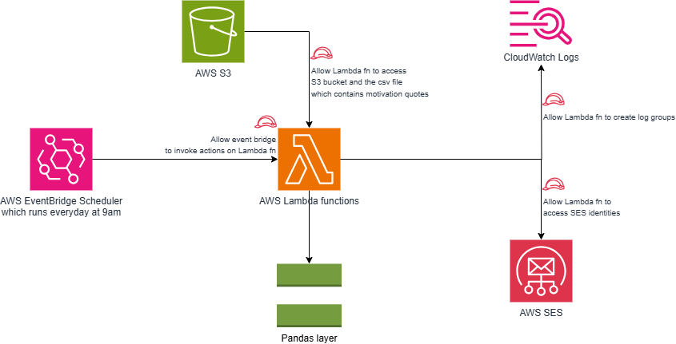

# AWS Lambda Motivational Quotes Scheduler

## 📌 Overview
This project is an AWS Lambda function that sends a **random motivational quote** daily at **9:00 AM UTC** using **Amazon EventBridge Scheduler** and **Amazon SES**.

## 🚀 Features
- Fetches a random quote from a **CSV file** stored in **S3**.
- Sends an **email notification** using **Amazon SES**.
- Uses **AWS EventBridge Scheduler** to run the function **daily at 9:00 AM**.

## 🏗 Architecture
- **Amazon S3**: Stores the CSV file containing motivational quotes.
- **AWS Lambda**: Reads the CSV file, selects a random quote, and triggers SES.
- **Amazon SES**: Sends the email with the quote.
- **Amazon EventBridge**: Triggers Lambda function daily at 9:00 AM.

## 🛠 Setup & Deployment
### Prerequisites
- AWS Account
- IAM Role with permissions for Lambda, EventBridge, SES, and S3
- Python installed locally

## [Working with Python Layers using manylinux wheel distribution](docs/WorkingWithPythonLayers.md)
- We need pandas to work with csv file.
- As pandas package is not directly avaiblable in Amazon Linux enviroment, we have to package the pandas layer so that we can use it in our code.
- [Sometimes, a package that you want to include as a dependency won't have a universal wheel (specifically, it doesn't have any as the platform tag). In this case, download the wheel that supports manylinux instead. This ensures that your layer libraries are compatible with Amazon Linux.](https://docs.aws.amazon.com/lambda/latest/dg/python-layers.html#python-layer-manylinux)

Here’s an updated version of your challenges section with **headings** and **emojis** for a more engaging look:

---

### 💡 **Challenges Faced**
1. **🧪 Testing Layers Individually**
   - It was essential to test each layer individually to ensure everything was functioning correctly and avoid conflicts between libraries.
2. **⚠️ Layer Size Limit (250 MB)**
   - AWS Lambda enforces a **250 MB** size limit for layers. Always check the size of the unzipped content before uploading to ensure you don't run into any issues.
3. **🔄 Pandas and Numpy Dependencies**
   - Installing **Pandas** automatically installs **Numpy** as a dependency.
   - Initially, I uploaded both **Numpy** and **Pandas** layers separately, but this reduced the available space for other libraries like **openpyxl**.
   - After inspecting the contents of the Pandas layer, I found **Numpy** was already included. So in my next attempt, I uploaded only the **Pandas** layer, which saved space and worked efficiently.
4. **📦 Uploading Large Layers (>50MB)**
   - If the zip file for a library exceeds **50 MB**, you’ll need to upload it via an **S3 bucket** rather than directly to Lambda, avoiding size limitations.

## Acknowledgments
- The idea for this project was provided by [Kriti Bhandari](https://www.linkedin.com/in/kritibhandari/).
